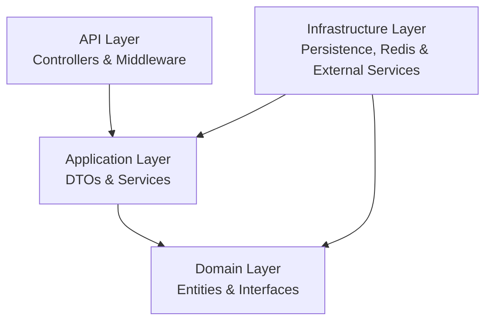

# 🛒 E-Commerce API


A production-oriented **E-Commerce RESTful API** built with **ASP.NET Core / .NET 8**, following **Clean Architecture** and modern backend development practices.

The project is designed to simulate a real-world e-commerce backend while focusing on **maintainability, scalability, security, performance, concurrency, payments, caching, background processing, observability, and testing**.

---

## 📌 Overview

This project provides a complete backend foundation for an E-Commerce platform, including:

* 🛍️ **Product Catalog** — Products, Categories, Brands, Images & Variants
* 🛒 **Shopping Basket & Wishlist**
* 📦 **Orders & Order State Machine**
* 🎟️ **Coupons & Discounts**
* 💳 **Stripe Payment Integration & Webhooks**
* 🔐 **Authentication & Authorization**
* 👥 **Role-Based & Permission-Based Authorization**
* 🔄 **JWT Access & Refresh Tokens**
* ⚡ **Redis Distributed Cache & Distributed Locking**
* ⏱️ **Background Jobs & Hangfire**
* 📧 **Email Notifications**
* 🏥 **Health Checks**
* 📊 **Serilog & OpenTelemetry**
* 🔒 **Optimistic Concurrency & Transactions**
* 🧪 **Automated Testing**
* 🐳 **Docker & Docker Compose**
* 🔄 **GitHub Actions CI/CD**

The main goal is to build a backend that follows real-world software engineering practices rather than implementing only basic CRUD operations.

---

# 🏗️ Architectural Principles

The project follows **Clean Architecture** principles with clear separation of responsibilities and loosely coupled layers.



### Architectural Core Concepts

* **Clean Architecture**
* **Separation of Concerns**
* **SOLID Principles**
* **Dependency Injection**
* **Repository Pattern**
* **Unit of Work**
* **Specification Pattern**
* **DTO Pattern**
* **Value Objects / Owned Types**
* **Interface-based Service Design**

---

# 🗂️ Project Structure

```text
Ecommerce
│
├── Domain
│   ├── Entities
│   ├── Enums
│   ├── Exceptions
│   └── Interfaces
│
├── Application
│   ├── Authorization
│   ├── DTOs
│   ├── Interfaces
│   ├── Services
│   ├── Specifications
│   └── Mapping
│
├── Infrastructure
│   ├── Authorization
│   ├── Identity
│   ├── Persistence
│   ├── Payments
│   ├── Redis
│   ├── BackgroundJobs
│   └── Logging
│
├── API
│   ├── Controllers
│   ├── Middleware
│   ├── Extensions
│   └── Configuration
│
└── Tests
    └── Domain.Tests
```

---

# ✨ Features

## 1. 🛍️ Product Catalog & Advanced Querying

* Complete CRUD operations for **Products**, **Categories**, and **Brands**.
* Support for **Product Variants** including SKU, Price, and Stock.
* Product image management.
* Product specifications and status management.
* Advanced querying using the **Specification Pattern**.
* Pagination.
* Search.
* Filtering.
* Sorting.
* Projection.
* Optimized read-only queries using `AsNoTracking()`.

---

## 2. 🔐 Authentication & Authorization

### Authentication

* ASP.NET Core Identity
* JWT Bearer Authentication
* Access Tokens
* Refresh Tokens
* Refresh Token Rotation
* Token Revocation

### Authorization

The project demonstrates both **Role-Based Authorization** and **Permission-Based Authorization**.

```text
Role
  ↓
Permission
  ↓
Policy
  ↓
Endpoint
```

Current permissions include:

```text
Products.Read
Products.Create
Products.Update
Products.Delete

Orders.Read
Orders.Update

Users.Read
Users.Update
```

Permission-based authorization is implemented using:

* Permission Definitions
* Permission Requirements
* Authorization Handlers
* Dynamic Policy Provider
* Permission Seeder
* Permission Claims
* JWT Permission Claims

Example:

```csharp
[Authorize(Policy = Permissions.Products.Create)]
```

Role-based authorization is also used where appropriate:

```csharp
[Authorize(Roles = "Admin")]
```

---

## 3. 🛒 Shopping Basket & Wishlist

### Shopping Basket

The basket system supports:

* Add Product
* Remove Product
* Update Quantity
* Clear Basket
* Calculate Basket Total
* Validate Product Stock

Redis is used for distributed basket storage.

```text
User
 ↓
Basket
 ↓
Basket Items
 ↓
Redis
```

### Wishlist

The Wishlist supports:

* Add Product
* Remove Product
* Get Wishlist
* Move Product to Basket
* Duplicate prevention

---

## 4. 📦 Orders & Checkout

The order processing pipeline follows:

```text
Basket
  ↓
Checkout
  ↓
Order
  ↓
Order Items
  ↓
Payment
  ↓
Order Status
```

### Order Status

```text
Pending
   ↓
Confirmed
   ↓
Processing
   ↓
Shipped
   ↓
Delivered
```

Cancellation is also supported according to the implemented state transitions.

The project uses an **Order State Machine** to prevent invalid order status transitions.

---

## 5. 🔒 Optimistic Concurrency

The project implements **Optimistic Concurrency** using SQL Server `RowVersion` and EF Core concurrency handling.

Example scenario:

```text
Stock = 1

User A ──────┐
             ├── Purchase Product
User B ──────┘
```

The system detects conflicting updates and prevents invalid concurrent modifications.

Implemented concepts include:

* `RowVersion`
* Concurrency Tokens
* EF Core Concurrency Exceptions
* Transactions
* Stock Validation

---

## 6. 🔐 Distributed Checkout Locking

Redis is also used to provide a distributed lock during checkout operations.

Example:

```text
lock:checkout:{basketId}
```

This helps prevent multiple concurrent checkout attempts for the same basket.

---

## 7. 🎟️ Coupons & Discounts

The coupon system supports:

* Percentage Discounts
* Fixed Amount Discounts
* Expiration Dates
* Active / Inactive Status
* Minimum Order Amount
* Maximum Discount
* Usage Limits
* Usage Tracking
* Coupon Validation

Example:

```text
Order Total: $100
Coupon: 20% OFF
Discount: $20
Final Total: $80
```

---

## 8. 💳 Payment Processing

The payment system uses an abstraction-based architecture:

```text
IPaymentService
      ↓
PaymentService
      ↓
Payment Provider
```

This allows payment providers to be replaced without tightly coupling the application to a specific implementation.

### Stripe Integration

The project supports:

* Stripe Checkout
* Payment Creation
* Payment Status Handling
* Payment Lifecycle
* Idempotency Keys
* Stripe Webhooks
* Webhook Signature Validation

---

## 9. 🔁 Idempotency

Idempotency is implemented in the payment flow to help prevent duplicate payment operations when requests are retried.

```text
Client Request
      ↓
Idempotency Key
      ↓
Payment Provider
```

This provides safer payment processing when network failures or duplicate requests occur.

---

## 10. ⏱️ Background Processing

Background processing is implemented using:

* `BackgroundService`
* Hangfire

Background jobs are suitable for tasks that should not block HTTP requests.

Examples include:

* Expired Coupon Processing
* Expired Refresh Token Cleanup
* Low Stock Checks
* Cleanup Operations
* Email Notifications

---

## 11. 🟠 Hangfire

Hangfire is used for background job processing.

Implemented job concepts include:

### Fire-and-Forget Jobs

Used for asynchronous operations such as email notifications.

### Delayed Jobs

Jobs can be scheduled to execute after a specified delay.

### Recurring Jobs

Recurring tasks can execute according to a schedule.

### Automatic Retries

Failed background jobs can be retried automatically.

### Dashboard

Hangfire Dashboard provides visibility into background job execution.

---

## 12. 📧 Notifications

The project supports notification-related background processing.

Examples include:

* Order Confirmation Emails
* Order Status Notifications
* Payment Notifications
* Low Stock Notifications

Email operations can be processed in the background to avoid blocking API requests.

---

## 13. 🗄️ Entity Framework Core

The project uses **Entity Framework Core** with SQL Server.

Implemented EF Core concepts include:

* Code First
* Migrations
* Fluent API
* Relationships
* Database Indexes
* Transactions
* `AsNoTracking`
* Projection
* Specification Pattern
* Owned Types
* Shadow Properties
* Global Query Filters
* Concurrency Tokens
* RowVersion
* EF Core Interceptors
* Query Optimization

---

## 14. ⚡ EF Core Performance Optimization

The project applies practical EF Core performance techniques:

### `AsNoTracking`

Used for read-only queries to avoid unnecessary change tracking.

### Projection

Only required fields are selected from the database instead of loading unnecessary entity data.

### Pagination

Large datasets are retrieved in smaller pages.

### Database Indexing

Indexes are used to improve frequently executed queries.

### Avoiding N+1 Queries

Projection and appropriate Includes are used to reduce unnecessary database round trips.

---

## 15. 🧩 EF Core Interceptors

An EF Core interceptor is used for automated entity auditing.

The interceptor handles audit-related properties such as:

```text
CreatedAt
CreatedBy
UpdatedAt
UpdatedBy
```

This keeps auditing concerns separated from individual application services.

---

## 16. 🏠 Owned Types / Value Objects

Address information is modeled using EF Core owned types.

Example:

```text
Order
 └── ShipToAddress
      ├── FirstName
      ├── LastName
      ├── Street
      ├── City
      └── Country
```

This allows value-based data to remain encapsulated within its owning entity.

---

## 17. 📐 Specification Pattern

The Specification Pattern is used to encapsulate reusable query logic.

Specifications can contain:

* Filtering
* Includes
* Sorting
* Pagination
* Query Conditions

This keeps query logic reusable and prevents controllers and services from becoming tightly coupled to EF Core.

---

## 18. ⚡ Redis

Redis is used as a distributed data store and caching solution.

Current usage includes:

* Shopping Basket Storage
* Distributed Checkout Locking
* Distributed Caching
* Health Checks

Redis can also be used to cache frequently accessed application data.

---

## 19. 🏥 Health Checks

ASP.NET Core Health Checks are configured for infrastructure dependencies.

Current health checks include:

```text
Application
    │
    ├── SQL Server
    │
    └── Redis
```

This provides visibility into the availability of important application dependencies.

---

## 20. 📊 Logging & Observability

### Serilog

Structured logging is implemented using **Serilog**.

Logging supports:

* Console Logging
* File Logging
* Structured Logs

### OpenTelemetry

OpenTelemetry provides application observability through:

* Tracing
* Metrics
* ASP.NET Core Instrumentation
* Entity Framework Core Instrumentation
* Redis Instrumentation

---

## 21. 🛡️ Security

The project applies several security practices:

* JWT Authentication
* Refresh Token Security
* Token Revocation
* Role-Based Authorization
* Permission-Based Authorization
* Password Policies
* Account Lockout
* Rate Limiting
* CORS
* Security Headers
* Input Validation
* SQL Injection Protection through EF Core
* Secure Configuration Practices

Sensitive configuration values should be provided through **User Secrets or Environment Variables** rather than committed to source control.

---

## 22. 🚦 Rate Limiting

API Rate Limiting is implemented to reduce abuse and protect endpoints from excessive requests.

```text
Client
  ↓
Rate Limiter
  ↓
API
```

---

## 23. 🗜️ Response Compression

Response compression is enabled to reduce HTTP response payload sizes and improve network efficiency.

```text
API Response
     ↓
Compression
     ↓
Smaller Payload
     ↓
Client
```

---

## 24. 🌐 CORS

Cross-Origin Resource Sharing is configured to control which external applications are allowed to communicate with the API.

---

## 25. 📚 Swagger / OpenAPI

Swagger/OpenAPI is configured for API documentation and interactive endpoint testing.

It can be used to:

* Explore API endpoints
* Test requests
* Inspect request/response models
* Test authenticated endpoints
* Understand API contracts

---

# 🧪 Testing

The project contains automated tests covering important business logic.

Current testing areas include:

* Coupon Calculation Tests
* Order Tests
* Order State Machine Tests
* Authorization / Permission Handler Tests

Run the tests using:

```bash
dotnet test
```

---

# 🐳 Docker

The project includes Docker support for running the application and infrastructure consistently.

Docker Compose includes:

```text
┌─────────────────┐
│  Ecommerce API  │
└────────┬────────┘
         │
 ┌───────┴────────┐
 │                │
 ▼                ▼
SQL Server      Redis
```

### Run with Docker Compose

```bash
docker compose up -d --build
```

Swagger:

```text
http://localhost:8080/swagger
```

Hangfire Dashboard:

```text
http://localhost:8080/hangfire
```

---

# 🔄 CI/CD

The project includes a **GitHub Actions CI/CD workflow** designed to validate changes automatically.

The intended pipeline is:

```text
Developer Push / Pull Request
            ↓
     GitHub Actions
            ↓
         Restore
            ↓
          Build
            ↓
       Run Tests
            ↓
      Docker Build
            ↓
     Pipeline Success
```

### Automated Checks

* Restore project dependencies
* Build and compilation verification
* Execute automated xUnit tests
* Verify Docker image builds successfully
* Validate changes before merging into `main`

---

# 🧰 Technologies

| Category          | Technologies                 |
| ----------------- | ---------------------------- |
| Language          | C# 12                        |
| Framework         | .NET 8 / ASP.NET Core        |
| Architecture      | Clean Architecture           |
| ORM               | Entity Framework Core        |
| Database          | SQL Server                   |
| Authentication    | ASP.NET Core Identity, JWT   |
| Authorization     | Roles, Policies, Permissions |
| Mapping           | AutoMapper                   |
| Caching           | Redis                        |
| Background Jobs   | Hangfire, BackgroundService  |
| Payments          | Stripe                       |
| Logging           | Serilog                      |
| Observability     | OpenTelemetry                |
| API Documentation | Swagger / OpenAPI            |
| Testing           | xUnit                        |
| Containers        | Docker, Docker Compose       |
| CI/CD             | GitHub Actions               |

---

# 🧠 Design Patterns

| Pattern                | Application                       |
| ---------------------- | --------------------------------- |
| Repository             | Data access abstraction           |
| Unit of Work           | Coordinating database operations  |
| Specification          | Reusable database queries         |
| State Machine          | Order status transitions          |
| Strategy / Abstraction | Payment provider integration      |
| Interceptor            | Automated entity auditing         |
| Cache-Aside            | Redis caching strategy            |
| DTO                    | API request/response models       |
| Dependency Injection   | Loose coupling between components |

---

# 🚀 Getting Started

## Prerequisites

Make sure you have:

* .NET 8 SDK
* SQL Server or Docker
* Redis or Docker
* Visual Studio / VS Code
* Docker Desktop

---

## Clone the Repository

```bash
git clone https://github.com/YOUR_USERNAME/Ecommerce.git
cd Ecommerce
```

---

## Configuration

Sensitive configuration should be provided using **User Secrets** or environment variables.

Examples include:

* Database connection strings
* JWT signing keys
* Stripe secret keys
* Stripe webhook secrets
* Email credentials

Do not commit real secrets to GitHub.

---

## Database Migration

Using Package Manager Console:

```powershell
Update-Database
```

Or:

```bash
dotnet ef database update --project Infrastructure --startup-project API
```

---

## Run the Application

```bash
dotnet run --project API
```

---

# 🎯 Learning Objectives

This project was built as a practical backend learning project to gain hands-on experience with:

* ASP.NET Core Web API
* Clean Architecture
* REST API Development
* Entity Framework Core
* SQL Server
* ASP.NET Core Identity
* JWT Authentication
* Role-Based Authorization
* Permission-Based Authorization
* Redis
* Background Processing
* Hangfire
* Stripe Payments
* Webhooks
* Idempotency
* Optimistic Concurrency
* Transactions
* Docker
* Automated Testing
* Logging
* Observability
* API Security

The goal is not only to make the API work, but to understand **why each technology, pattern, and architectural decision is used**.

---

# 👨‍💻 Author

## Abdelrhman Samir

**.NET Backend Developer**

* 💼 LinkedIn: [Abdelrhman Samir](https://www.linkedin.com/in/abdo-samir-a95884200/)
* 📧 Email: `abbddoosaammiirr@gmail.com`
* 📱 WhatsApp: `+20 106 494 9734`

---

# ⭐ Project Status

🚧 **Actively Developed**

This project is continuously improved with additional backend concepts, security enhancements, testing, performance optimization, and production-oriented practices.

If you find this project useful, feel free to ⭐ the repository.
